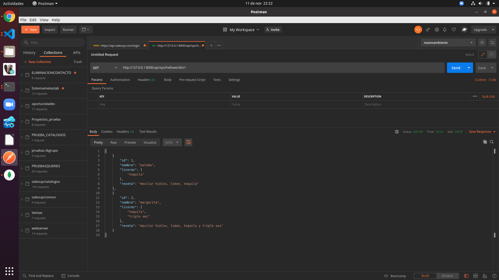
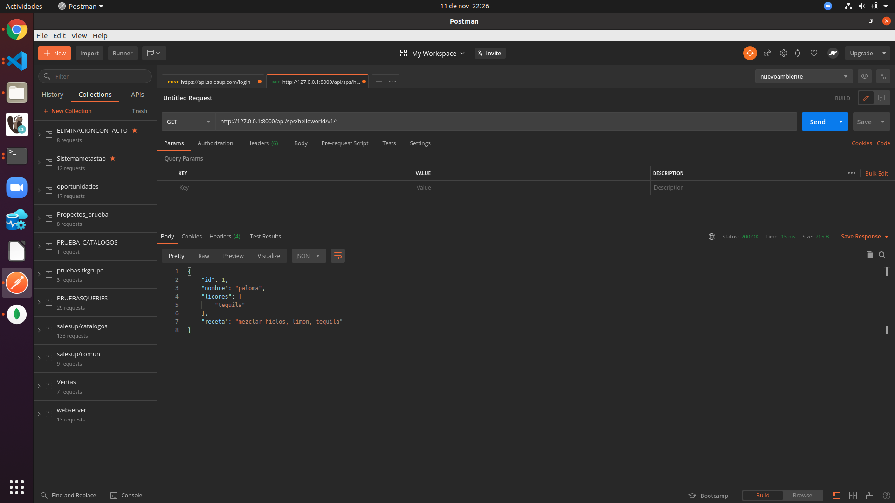
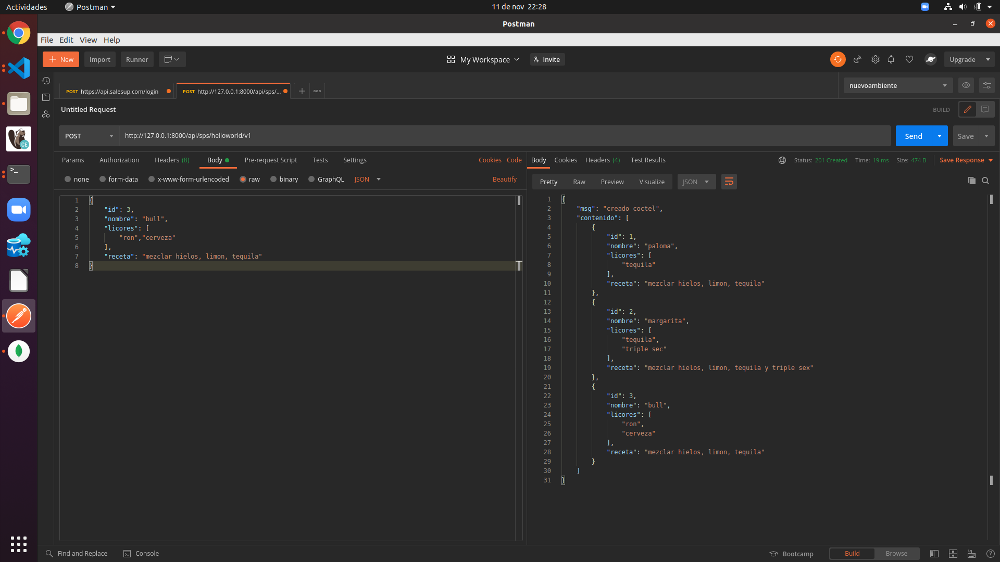
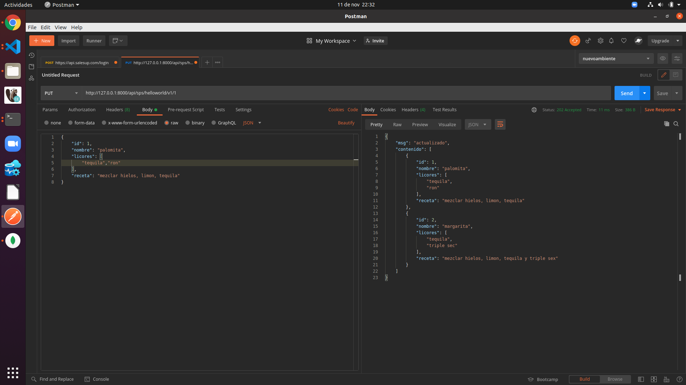
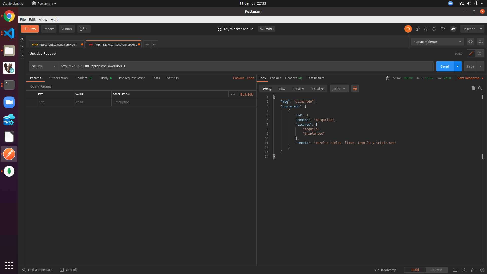

# Fast Api Test1
Comenzaremos creando un ambiente virtual para no instalar los paquetes de manera global en la máquina, para esto usaremos virtualenv

    virtualenv -p python3 env
Activamos el ambiente virtual 

    source env/bin/activate

Una vez activado el ambiente virtual se comenzará con instalar fastApi y uvicorn

    pip install fastapi uvicorn

una vez instalado nuestros paquetes generaremos una endponit a la siguiente ruta '/api/sps/helloworld/v1 '
Se creara un CRUD a la ruta que se tratara sobre cocteles.

## Listado

Para la ruta de listado el request será simplemente la ruta '/api/sps/helloworld/v1 ' , el método es get y la respuesta será el siguiente como se muestra en la imagen. 

## Detalle

Para la ruta de detalle, el request, solo será el parámetro identificador id, para encontrar el elemento buscado de la siguiente manera  '/api/sps/helloworld/v1/{id}', el metodo es get y la respuesta será la siguiente como se muestra en la imagen. 

### Creación

Para la ruta de creación, el request, tendrá información en el body, la información que se espera y se especifica en el código es el siguiente. 

    {
        "id": 1,
        "nombre": "palomita",
        "licores": [
            "tequila","ron"
        ],
        "receta": "mezclar hielos, limon, tequila"
    }

La ruta a la que se enviara la petición es la siguiente  '/api/sps/helloworld/v1', el método es post y la respuesta será como se muestra en la imagen.

## Actualización

Para la ruta de actualización, el request, tendrá la información en el body, la información que se espera y se especifica en el código es el siguiente, adicionalmente se necesita el, id que se enviara en la ruta como parámetro 

    {
        "id": 1,
        "nombre": "palomita",
        "licores": [
            "tequila","ron"
        ],
        "receta": "mezclar hielos, limon, tequila"
    }

La ruta a la que se enviara la petición es  '/api/sps/helloworld/v1/{id}' con el metodo put. La respuesta será la siguiente como se muestra en la imagen 

## Eliminación

Para la parte de eliminación se enviará solamente el, id en la ruta '/api/sps/helloworld/v1/{id}' con el metodo delete y la respuesta será la siguiente como se muestra en la imagen 

